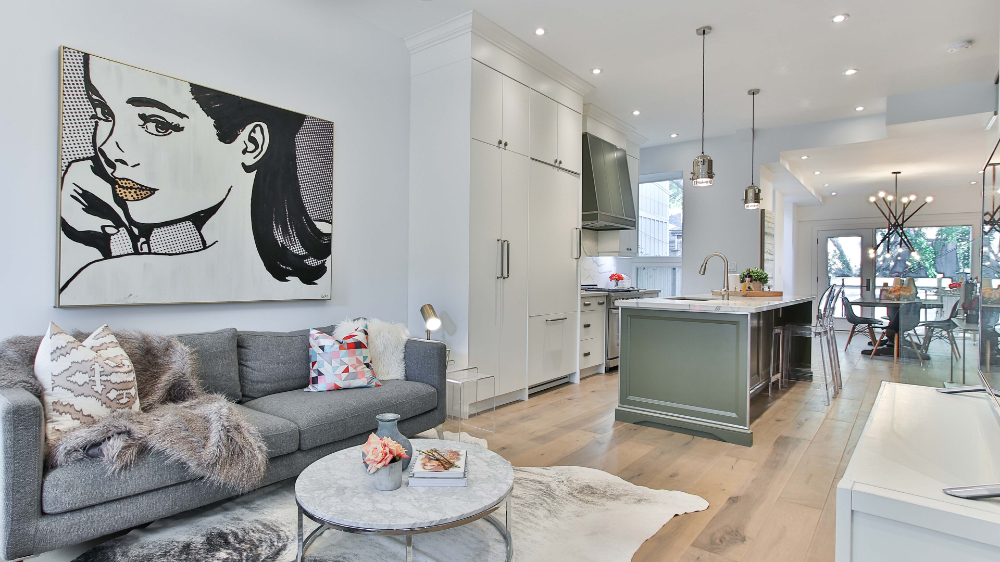
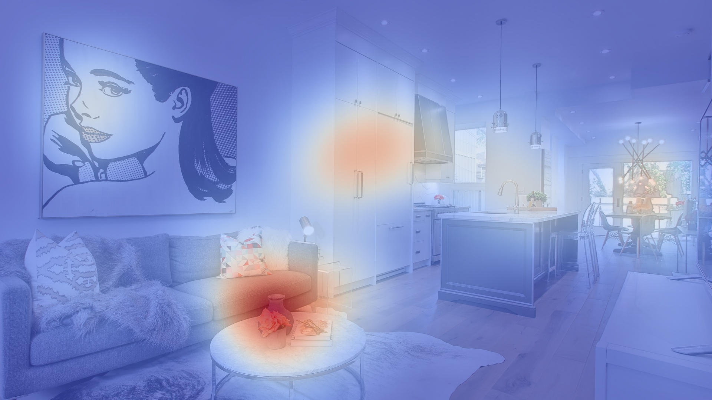

# Rust saliency map generator

A simple implementation of a saliency map generation script wrtten in Rust for training.

## Usage

```console
$ `./saliency_map --help`

Usage:
  ./saliency_map [OPTIONS] [PATH TO FIXATION LIST FILE]
  
Generate a (blended) saliency map image from a list of 2d points.

Positional arguments:
  Path to fixation list file
                        Fixation list is a csv file with a header and one X,Y
                        value pair per line (Mandatory)

Optional arguments:
  -h,--help             Show this help message and exit
  --img_path IMG_PATH   Path to image to blend with saliency map (def: empty)
  --sigma SIGMA         Sigma (in degrees of field of view) for the Gaussian
                        filter (def: 2)
  --px2deg PX2DEG       Pixel to degree ratio to apply (def: 60)
  --width WIDTH         Width of output image in pixels (def: 1920)
  --height HEIGHT       Height of output image in pixels (def: 1080)
  --blend BLEND         Saliency map to stimulus blend ratio (def: .5)
```

## Example

```console
$ ./saliency_map explor_12.csv --img_path explor_12.jpg  --sigma 1.5 --blend .7
```




